# PoC with Copilot Studio + Power Automate + Azure OpenAI
# Table SAP Copilot: Empowering SAP Data Interaction

The SAP Table Copilot is a tool designed to help SAP users in their interaction with data in SAP tables. This solution, powered by a Azure OpenAI, focuses on enhancing user experience and data accessibility through:

- Intelligent Query Handling: Engage in a dynamic, question-and-answer format to delve into the specifics of any single SAP table, making data insights more accessible and actionable.
- Advanced Connectivity: Leverage the sophisticated integration capabilities of the SAP ERP Table connector, part of the Microsoft Power Platform, to ensure seamless and reliable data interactions.

While this repository focuses on singular table interactions and is optimal for scenarios where single-table data conversations suffice, we acknowledge the complexity and interconnectedness of enterprise data. For use cases necessitating a dialogue involving multiple tables with interdependencies, we recommend exploring our dedicated repository at SAP Data Conversational Interface, specifically tailored for multi-table interactions.

**Greetings in Teams**

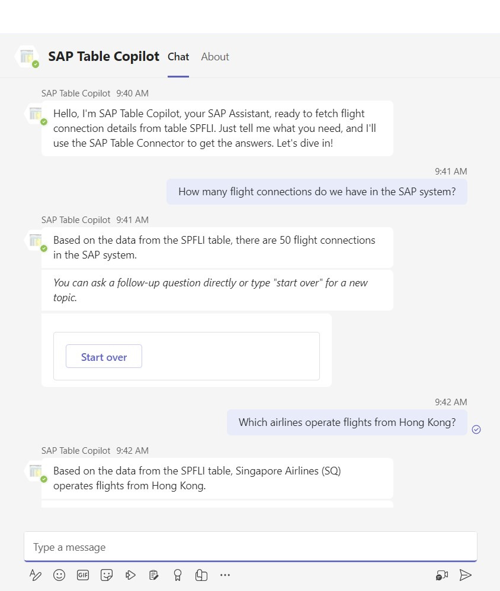

**Architecture**

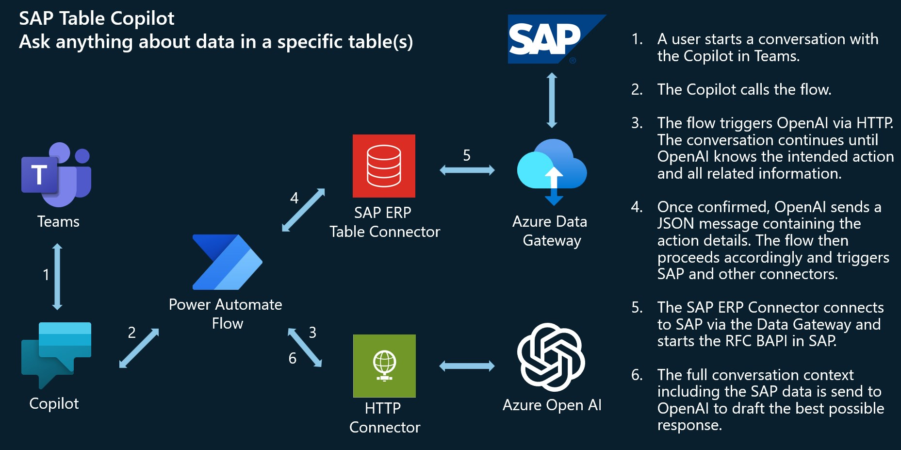

## Prerequesites

1. Power Platform Access
    - Power Virtual Agent (PVA), to create the copilot https://web.powerva.microsoft.com/
    - Power Automate Flows: https://make.powerautomate.com/
    - Recommended for productive use is separated DEV and PROD environments
    - Trial license: https://learn.microsoft.com/en-us/power-apps/maker/signup-for-powerapps
1. Azure Subscription
    - Azure Trial: https://azure.microsoft.com/en-us/free
1. Azure OpenAI Service
    - Deployment Guide: https://learn.microsoft.com/en-us/azure/ai-services/openai/how-to/create-resource?pivots=web-portal
    - Request Access to OpenAI as described.
    - gpt-4-32k is recommended for this use case due to larger context with longer discussions.
    - Therefore pay attention during the request for regions that can provide gpt-4-32k (e.g. Several in the US, France, Canada, Sweden)
1. On-Premises Data Gateway
    - Deploement Guide: https://learn.microsoft.com/en-us/power-automate/gateway-reference
1. SAP System
    - Access to an SAP System
    - RFC user with read permission on the specific table
    
# Setup

## Azure OpenAI Service

- Follow this documentation to deploy the Azure OpenAI Service: https://learn.microsoft.com/en-us/azure/ai-services/openai/how-to/create-resource?pivots=web-portal   
- Once the OpenAI Service is deployed go to the OpenAI Studio, enter Deployments and deploy the gpt-4-32k model.  

    

- Retrieve your endpoint URL and Key in "Chat Playground" -> "View code".

    

## Import the Solution

This step will import the required components into your environment. Make sure you are connected to your Non-PROD environment.

- Download the solution as zip file: [Download the Solution](https://github.com/mimergel/SAP_Table_Copilot/raw/main/solution/SAPTableCopilot_1_0_0_3.zip).

- Login to https://make.powerapps.com/ 
- Go to Solutions.
- Choose "Import solution".

      

- Browse files and select the downloaded SAPTableCopilot_[version number].zip.
- During the subsequent steps you'll need to update the connection references:

    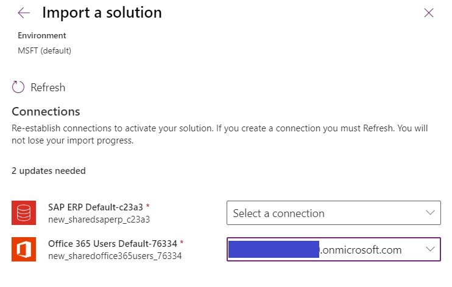  

- For Teams and Office 365 you might have already connections and you could simply choose from the list. Otherwise create these as well.
- Create the required SAP ERP Connection:

    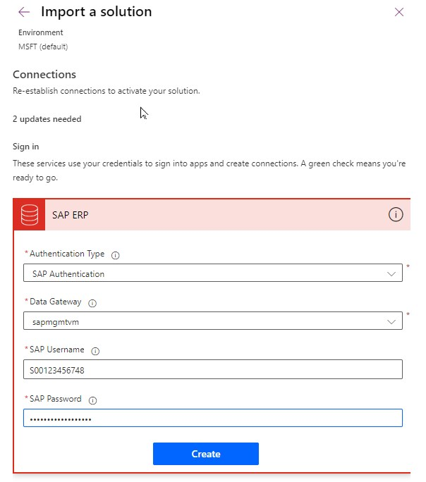  

    Enter the RFC user name and password.

- In the next import step you will enter your URL and KEY information for the Azure OpenAI service.

    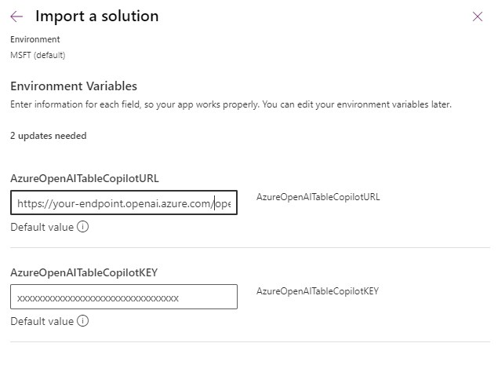  

 - Now after refreshing and entering the connection reference you can proceed to import the solution.
 - The import warning "Solution "SAP Table Copilot" imported successfully with warnings: Flow server error returned with status code BadGateway ..." can be ignored for now as this will be fixed with the next step. 

## Update the SAP ERP Table Connector

- Go to: https://make.powerautomate.com/
- Enter the Flow and switch to edit mode
- Update the SAP System reference 

      

- Save the flow
- Turn on the flow

      

## Publish the Copilot

- Login to https://web.powerva.microsoft.com/ 
- You should see the imported copilot. If not check that you are in the same environment where you have imported the solution. 

      

- Click on the name and then go to "Publish"

    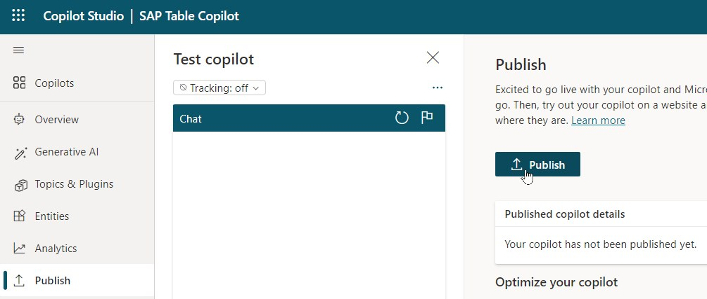  

- The most common publishing failure is when you forgot to turn on the flow in the previous step.
- Go to "Settings" -> "Channels" to connect the Copilot with Teams.

## Connect to Teams

- Connect the Copilot to Teams

    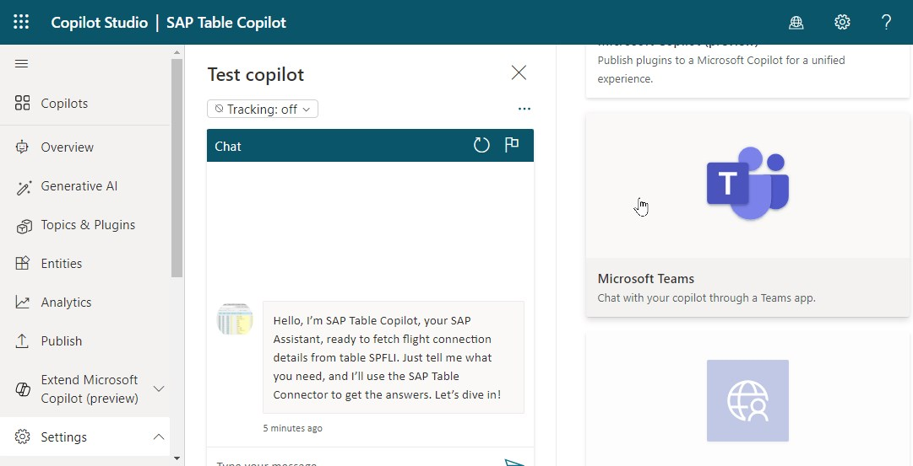  

- Turn on Teams

    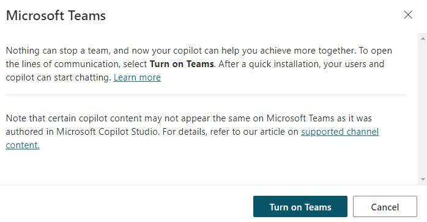  

- Open Copilot in Teams

    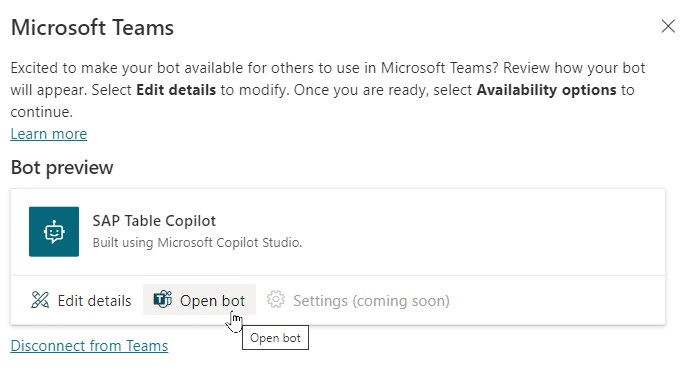  

- Finally open the Copilot in Teams by using the web app instead.
- Cancel the request to open the teams app to avoid opening your desktop app and leaving your work or school tenant.

    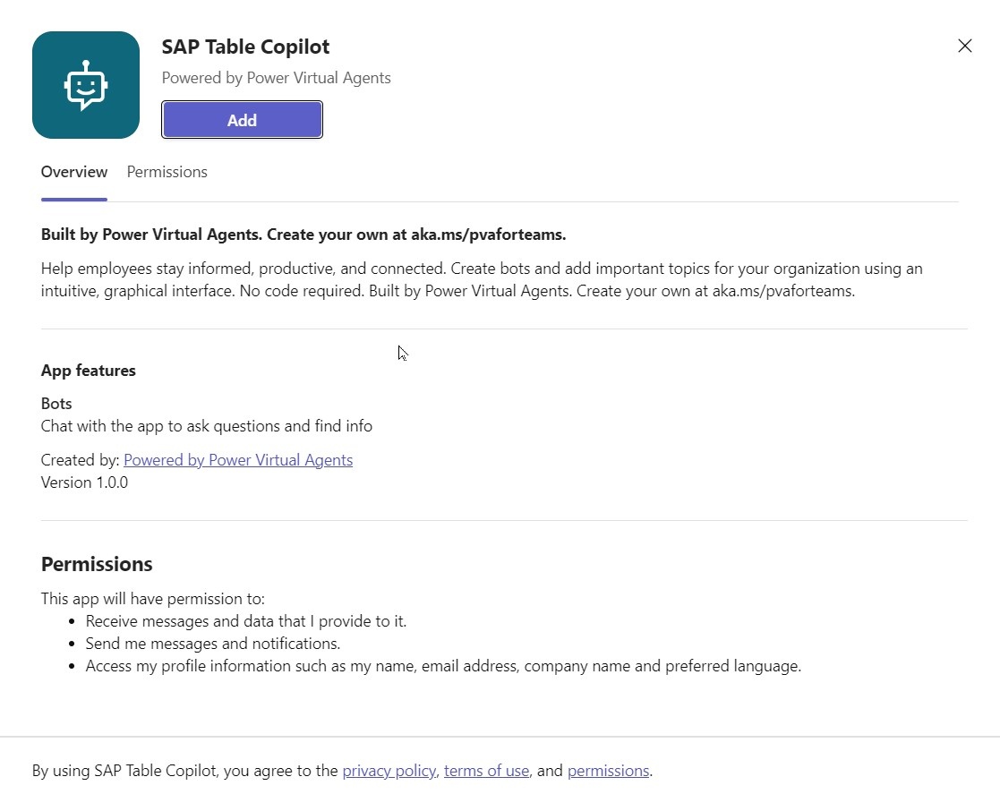  

## Test the Copilot

- A first test can be done in the "Test Copilot" area of the Copilot Studio.
- Ask a simple question for the first test.
- Example: "How many flight connections do we have in the SAP system?"

      

- The next test can be done in Teams.

    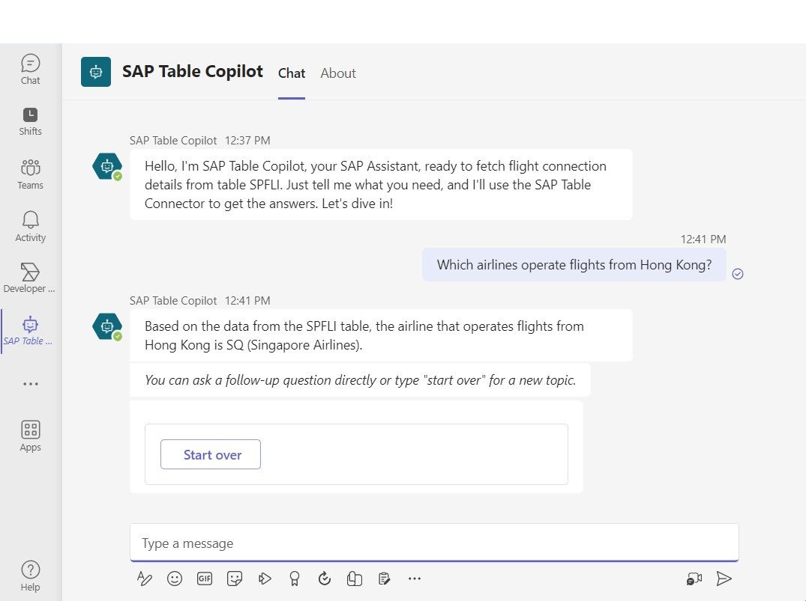  

## Troubleshooting

- In case of errors most likely the primary or the child flow failed.  
    - Check here: https://make.powerautomate.com/ in  
        - "My Flows"    
        - "28-days run history"   
- The logs of the flow run provide helpful error messages.   

      

- In this case the copilot (bot) was not pointing to the correct Teams Channel and I had to change the value of "cr680_sapProductCopilot" to refelct the Channel of my environment. 

      

  

Other root causes could be: 
- SAP system not reachable
- On-Premises Data Gateway not available or service stopped. 
- HTTP timeouts of the Azure OpenAI service.
